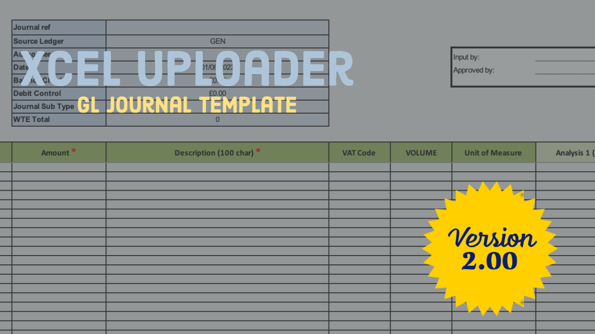

# Xcel Uploader GL Journal Template
Xcel Uploader Journal Template for eFinancials v6

  

## Worksheet Columns

| Column               | Data Type | Length     |
|----------------------|-----------|------------|
| Cost Centre          | Text      | 8          |
| Account              | Text      | 6          |
| Activity             | Text      | 8          |
| Job                  | Text      | 6          |
| Amount               | Number    | 15,2       |
| Description          | Text      | 100        |
| VAT Code             | Text      |            |
| Volume               | Number    | 15,2       |
| Unit of Measure      | Text      |            |
| Analysis 1           | Text      | 30         |
| Analysis 2           | Text      | 30         |
| Analysis 3           | Text      | 30         |
| Analysis 4           | Text      | 30         |
| Analysis 5           | Text      | 30         |
| Analysis 6           | Text      | 30         |
| Analysis 7           | Text      | 30         |
| Analysis 8           | Text      | 30         |
| Analysis 9           | Text      | 30         |
| Analysis 10 (Number) | Number    | 15,2       |
| Analysis 11 (Number) | Number    | 15,2       |
| Analysis 12 (Number) | Number    | 15,2       |
| Analysis 13 (Date)   | Date      | dd/mm/yyyy |
| Analysis 14 (Date)   | Date      | dd/mm/yyyy |

## Releases

### v2.0 (01-AUG-2023)

Second release of the Xcel Uploader **GL Journal Template**. Minor adjustments and fixes as per client feedback.

## Issues

 As always, [submit issues](https://github.com/finsysio/gl-journal-template/issues/new) that you run into with this 
 guide or with the application.

## Change log

 We'll keep track of each release in the [CHANGELOG.md](./CHANGELOG.md) 
